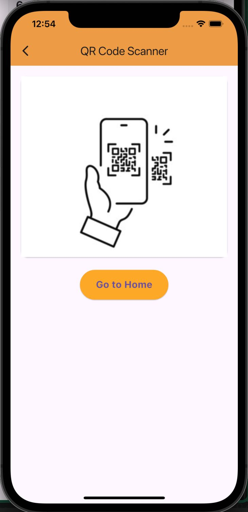

# My Attendance App

A new Flutter project.
A Flutter-based application designed to efficiently mark attendance for events. Only registered attendees will be able to mark their presence during the event.

This app gives a basic frontend idea about the app.
And I have not connected backend to the app yet.

## Getting Started

This project is a starting point for a Flutter application.

A few resources to get you started if this is your first Flutter project:

- [Lab: Write your first Flutter app](https://docs.flutter.dev/get-started/codelab)
- [Cookbook: Useful Flutter samples](https://docs.flutter.dev/cookbook)

For help getting started with Flutter development, view the
[online documentation](https://docs.flutter.dev/), which offers tutorials,
samples, guidance on mobile development, and a full API reference.

These are some of the demo images of the app.

 

